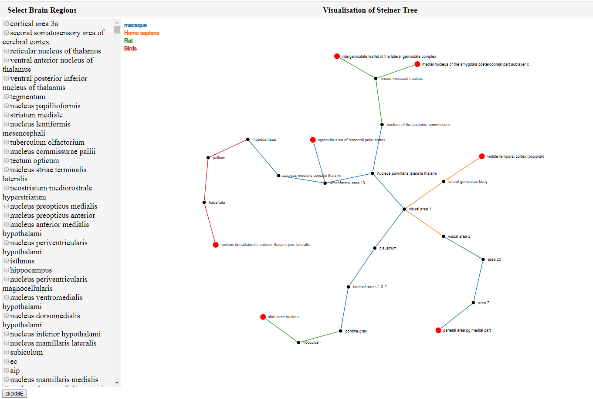

### Connected Brain Regions (SMT-Neurophysiology)
SMT-Neurophysiology is a web-based tool to find a connectivity path among a given set of brain regions. Specifically, this tool uses a Steiner Minimal Tree approximation algorithm to find a connectivity path among the brain regions. This tool is deployed at this address: https://dewancse.github.io/connected-brain-regions/index.html

### Installing SMT-Neurophysiology
Please do the following steps to install the SMT-Neurophysiology in your workspace:

- `git clone https://github.com/dewancse/connected-brain-regions.git`
- `npm install` to install packages
- open `index.html` home page in the browser

### SMT-Neurophysiology workflow
SMT-Neurophysioloy consists of two panel: `left panel` shows some brain regions and `right panel` visualizes a connectivity path among a set of brain regions. Specifically, the user will select some brain regions from the `left panel` and the `right panel` will show a connectivity path among the selected brain regions. Press `Ctrl+F` and then enter a brain region to quickly find it on the `left panel`.



*A screenshot illustrating a connectivity path among a set of brain regions seleted by the user from the left-panel.*
### Accessibility
The application is accessible by navigating::
```
  https://dewancse.github.io/connected-brain-regions/index.html
```

### Programming Language
- JavaScript

### Limitations
We will implement Unit testing and Functional testing to make sure the code is functioning as expected.

### List of contributors
- Dewan Sarwar

### Acknowledgements
This project is supported by the MedTech Centre of Research Excellence (MedTech CoRE), the Aotearoa Foundation, and the Auckland Bioengineering Institute.